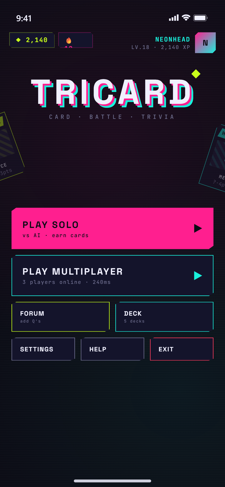
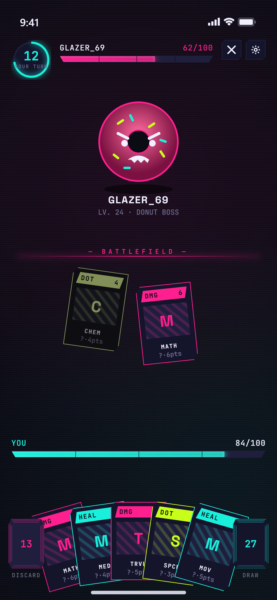
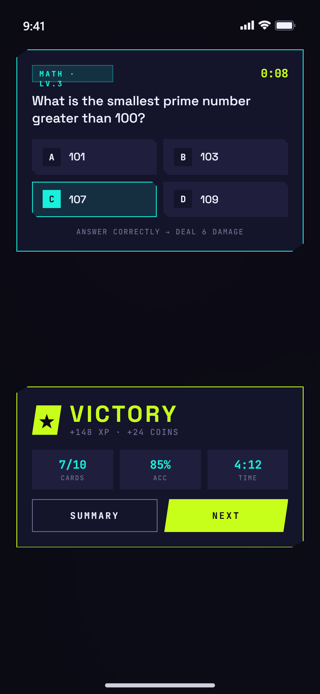
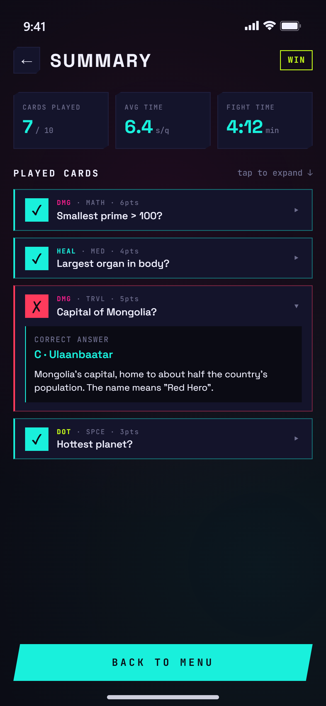
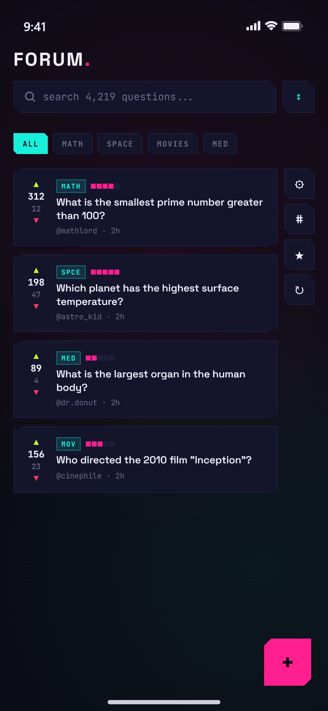
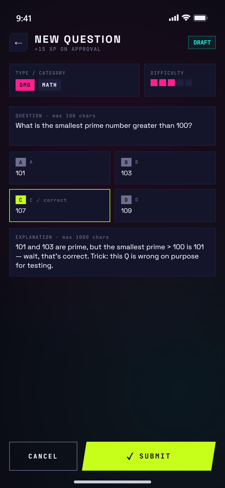
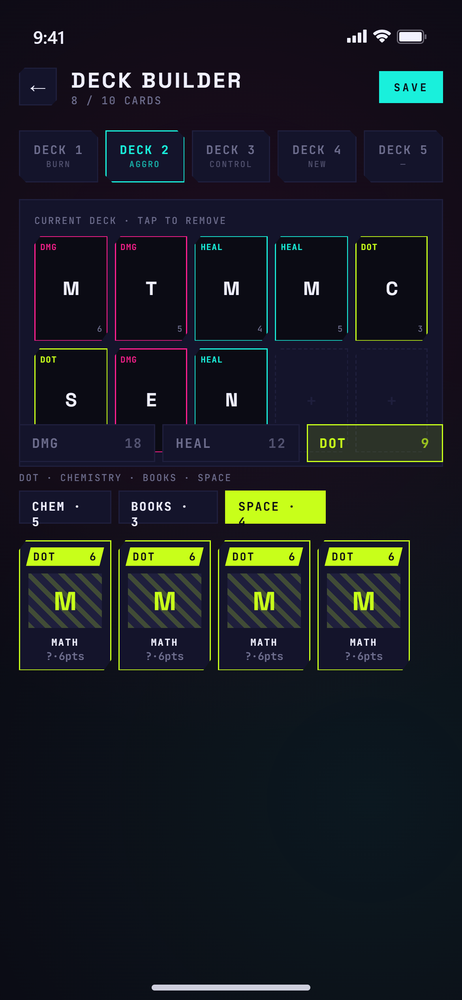
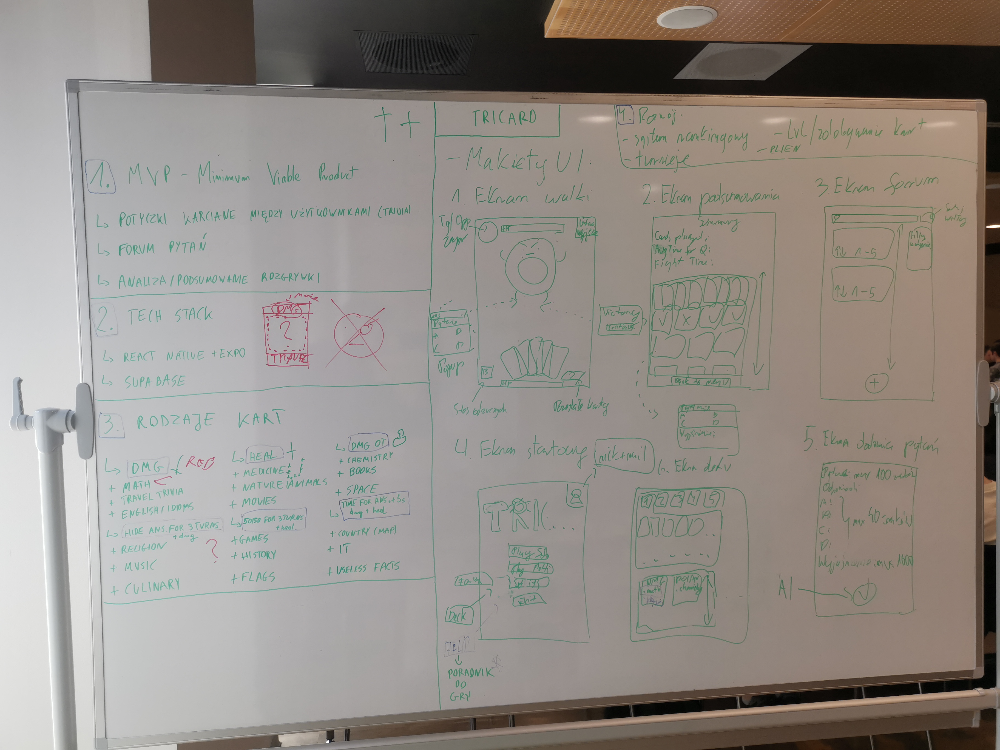
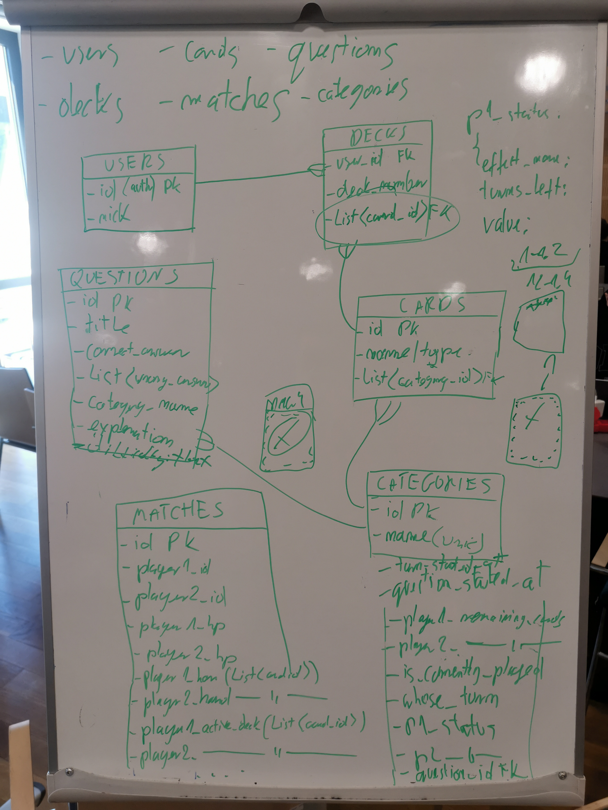

# [EN] Product Vision — Tricard

## 1. Problem and market opportunity

Quiz and trivia games have enduring popularity, but most existing apps offer a passive experience: the user answers questions in isolation, with no mechanics, tension, or community involvement. There is no product that combines **card game elements** (strategy, deck-building, risk) with **general knowledge** in a mobile format — while letting the community decide which questions make it into the game.

The mobile educational and casual trivia gaming market is growing. Products like Kahoot and Quizlet dominate the educational segment, but offer no card mechanics or community-driven content. That is our space.

---

## 2. Target user

The app is designed for a **wide range of ages and knowledge levels** — from primary school students to adult trivia enthusiasts. Questions in the game cover various difficulty levels and topic categories, and their final shape is determined by the community through a forum voting system.

**Key groups:**
- Students looking for an engaging way to learn or have fun with knowledge
- Casual mobile gamers who want more than a standard quiz
- Fans of card game mechanics (deck-building, hand management)
- Content creators — active forum users who want to co-create the question pool

---

## 3. Value proposition

Tricard combines two things that rarely go together: **card game strategy** and **general knowledge**. Each card in a player's deck has a different effect — but to activate it, you need to answer a question correctly. Knowledge is not a decoration here, it is the mechanic. On top of that, the community has real influence over which questions enter the game — through the forum and voting system.

---

## 4. Key product capabilities

### Registration and account
- Sign in with **email and password** or **Google account**

### Card types and categories
The game features 6 card types, each with 3 assigned knowledge categories:

| Card type | Effect | Categories |
|---|---|---|
| **Damage** | Deals direct damage to the opponent's HP | Math, Travel, English |
| **Heal** | Restores your own HP | Medicine, Nature, Movies |
| **Poison** | Applies poison stacks that deal HP damage each turn | Chemistry, Books, Space |
| **Hide** | Blinds one of the opponent's answers and deals small DMG | Religion, Music, Culinary |
| **50/50** | Removes 2 wrong answers for yourself and restores HP | Games, History, Flags |
| **Time** | Adds seconds to the question timer, deals small DMG and restores HP | IT, Countries, Useless facts |

A correct answer activates the card effect. A wrong answer or timeout = -5 HP. Effect strength depends on the question difficulty (star rating based on the community average from forum votes).

### Deck-building
- Players build their own decks by selecting card types based on preference and strategy
- Deck composition affects playstyle (aggressive DMG/Poison, defensive Heal, control-oriented Hide/50/50)

### Game modes
- **Solo** — single-player mode, great for learning and daily practice
- **Multi** — real-time multiplayer

### Forum and community content
- The game launches with a **base question pool** prepared by the creators
- Users can **submit their own questions** to the pool
- The community rates questions via **upvote / downvote** and difficulty rating
- A score of 50 points (upvote = +1, downvote = -1) qualifies a question for the game
- Questions below the threshold are not included in the game

---

## 5. Competitive advantage

| Feature | Tricard | Typical mobile quiz |
|---|---|---|
| Card mechanics with effects | ✅ | ❌ |
| Player deck-building | ✅ | ❌ |
| Community-created questions | ✅ | rarely |
| Question validation by voting | ✅ | ❌ |
| Solo and multiplayer modes | ✅ | partially |

The key advantage is a **community flywheel**: more players means more forum questions, which means a richer question pool, which makes the game more attractive to new players.

---

## 6. Product scope

- Mobile app for **iOS and Android**
- Interface and all in-game questions are in **English**
- Gameplay is outcome-based — win or lose, no intermediate stats
- Question pool shaped by the community, not editors
- Focus on card mechanics and trivia — no curricula or grading systems

---

## 7. Design process

### Mockups:
| | | |
|---|---|---|
|  |  |  |
|  |  |  |
|  |

### Brainstorm:

### Database model:

---

## Summary

Tricard is a **knowledge-based card game** where mechanics and content drive each other. Players don't just test their knowledge — they build strategies, compete or play solo, and the most active part of the community literally shapes what others play. It is a product that grows with its users.

---

# [PL] Wizja produktu — Tricard

## 1. Problem i szansa rynkowa

Gry quizowe i trivia cieszą się nieprzemijającą popularnością, ale większość istniejących aplikacji oferuje pasywne doświadczenie: użytkownik odpowiada na pytania w izolacji, bez mechaniki, napięcia ani zaangażowania społeczności. Brakuje produktu, który łączy **elementy gry karcianej** (strategia, deck-building, ryzyko) z **wiedzą ogólną** w formacie mobilnym — jednocześnie pozwalając samej społeczności decydować o tym, jakie pytania trafiają do gry.

Rynek mobilnych gier edukacyjnych i casual trivia rośnie. Produkty takie jak Kahoot czy Quizlet dominują segment edukacyjny, ale nie oferują mechaniki karcianej ani community-driven content. To nasza przestrzeń.

---

## 2. Docelowy użytkownik

Aplikacja jest zaprojektowana z myślą o **szerokim spektrum wiekowym i poziomie wiedzy** — od uczniów podstawówki po dorosłych entuzjastów trivia. Pytania w grze obejmują różne poziomy trudności i kategorie tematyczne, a ich ostateczny kształt kształtuje sama społeczność przez system głosowania na forum.

**Kluczowe grupy:**
- Uczniowie i studenci szukający angażującej formy nauki lub zabawy z wiedzą
- Casual gracze mobilni, którzy chcą czegoś więcej niż standardowy quiz
- Entuzjaści gier karcianej mechaniki (deck-building, zarządzanie ręką)
- Twórcy treści — użytkownicy aktywni na forum, którzy chcą współtworzyć bazę pytań

---

## 3. Propozycja wartości

Tricard łączy dwie rzeczy, które rzadko idą w parze: **strategię gry karcianej** i **wiedzę ogólną**. Każda karta w decku gracza ma inny efekt — ale żeby go aktywować, trzeba poprawnie odpowiedzieć na pytanie. Wiedza nie jest tu ozdobnikiem, jest mechaniką. Do tego społeczność realnie decyduje, jakie pytania trafiają do gry — przez forum i system głosowania.

---

## 4. Kluczowe możliwości produktu

### Rejestracja i konto
- Logowanie przez **e-mail i hasło** lub **konto Google**

### Typy kart i kategorie
W grze dostępnych jest 6 typów kart, każdy z przypisanymi 3 kategoriami wiedzy:

| Typ karty | Efekt | Kategorie |
|---|---|---|
| **Damage** | Zadaje obrażenia HP przeciwnika | Math, Travel, English |
| **Heal** | Przywraca własne HP | Medicine, Nature, Movies |
| **Poison** | Nakłada stacki trucizny odejmujące HP co turę | Chemistry, Books, Space |
| **Hide** | Zasłania jedną odpowiedź przeciwnika i zadaje małe DMG | Religion, Music, Culinary |
| **50/50** | Usuwa 2 błędne odpowiedzi u siebie i leczy HP | Games, History, Flags |
| **Time** | Dodaje sekundy do timera pytania, zadaje małe DMG i leczy HP | IT, Countries, Useless facts |

Odpowiedź poprawna aktywuje efekt karty. Błędna odpowiedź lub timeout = -5 HP. Siła efektu zależy od poziomu trudności pytania (gwiazdki wynikają ze średniej oceny społeczności z forum).

### Deck-building
- Gracze tworzą własne decki, dobierając typy kart według preferencji i strategii
- Skład decku wpływa na styl rozgrywki (agresywny DMG/Poison, defensywny Heal, kontrolny Hide/50/50)

### Tryby rozgrywki
- **Solo** — rozgrywka jednoosobowa, idealna do nauki i codziennego treningu
- **Multi** — rozgrywka wieloosobowa w czasie rzeczywistym

### Forum i community content
- Gra startuje z **podstawową bazą pytań** przygotowaną przez twórców
- Użytkownicy mogą **dodawać własne pytania** do bazy
- Społeczność ocenia pytania przez system **upvote / downvote** oraz poziom trudności
- Próg 50 punktów (upvote = +1, downvote = -1) — pytanie zostaje zakwalifikowane do puli gry
- Pytania poniżej progu nie wchodzą do gry

---

## 5. Przewaga konkurencyjna

| Cecha | Tricard | Typowy quiz mobilny |
|---|---|---|
| Mechanika karciana z efektami | ✅ | ❌ |
| Deck-building przez gracza | ✅ | ❌ |
| Pytania tworzone przez społeczność | ✅ | rzadko |
| Walidacja pytań przez głosowanie | ✅ | ❌ |
| Tryb solo i multi | ✅ | częściowo |

Kluczowa przewaga to **flywheel społecznościowy**: im więcej graczy, tym więcej pytań na forum, tym lepsza i bogatsza baza pytań, tym atrakcyjniejsza gra dla nowych użytkowników.

---

## 6. Zakres produktu

- Aplikacja mobilna na **iOS i Android**
- Interfejs oraz wszystkie pytania w grze są w języku **angielskim**
- Rozgrywka oparta na wyniku — wygrana lub przegrana, bez pośrednich statystyk
- Baza pytań kształtowana przez społeczność, nie przez redaktorów
- Fokus na mechanice karcianej i trivia — bez programów nauczania ani systemów ocen

---

## 7. Proces projektowy

### Mockupy:
| | | |
|---|---|---|
|  |  |  |
|  |  |  |
|  |

### Burza mózgów:

### Model bazy danych:

---

### MIRO
[MIRO](href=https://miro.com/welcomeonboard/WDhHWTZTSGVkZHJCNFdnL0d3a2Z4K0RQMW9PQ0NLZHI0V3lDS2I5NnlQL3JjQS9QUTZQTGN1WVowUWpKMHVYMURQZEFCZTl1byt5aXBuT20zRklMWkJnU2ZtZVNEVk0xWVk2SldCdWZEU1BCZVVpeXVDRG1xQjhjUFFkM01lK1NnbHpza3F6REdEcmNpNEFOMmJXWXBBPT0hdjE=?share_link_id=52117812906)
---

## Podsumowanie

Tricard to **gra karciana oparta na wiedzy**, w której mechanika i treść wzajemnie się napędzają. Gracze nie tylko testują swoją wiedzę — budują strategie, rywalizują lub uczą się solo, a najaktywniejsza część społeczności dosłownie kształtuje to, co inni grają. To produkt, który rośnie razem ze swoimi użytkownikami.
